# N3RD Trivia Game - Architecture & Navigation Flow

## Comprehensive System Architecture

This document provides a complete overview of the N3RD Trivia game application architecture, including all services, screens, data flows, and navigation patterns.

## Architecture Diagram

```mermaid
graph TB
    subgraph "Application Layer"
        Main[main.dart<br/>App Entry Point]
        ErrorBoundary[ErrorBoundary Widget]
        RouteGuard[RouteGuard Widget]
        NavigationHelper[NavigationHelper]
    end

    subgraph "Core Services"
        AuthService[AuthService<br/>Authentication & User Management]
        GameService[GameService<br/>Core Game Logic]
        StatsService[StatsService<br/>Aggregated Statistics]
        GameHistoryService[GameHistoryService<br/>Game History Records]
        LeaderboardService[LeaderboardService<br/>Global Rankings]
        SubscriptionService[SubscriptionService<br/>Premium Access]
        RevenueCatService[RevenueCatService<br/>In-App Purchases]
    end

    subgraph "Feature Services"
        MultiplayerService[MultiplayerService<br/>Online Multiplayer]
        FriendsService[FriendsService<br/>Social Features]
        DirectMessageService[DirectMessageService<br/>Messaging]
        FamilyGroupService[FamilyGroupService<br/>Family Sharing]
        ChallengeService[ChallengeService<br/>Daily Challenges]
        AIModeService[AIModeService<br/>AI Adaptive Mode]
        TriviaGeneratorService[TriviaGeneratorService<br/>Content Generation]
        TriviaPersonalizationService[TriviaPersonalizationService<br/>Content Personalization]
    end

    subgraph "Support Services"
        AnalyticsService[AnalyticsService<br/>Event Tracking]
        LoggerService[LoggerService<br/>Error Logging]
        VideoCacheService[VideoCacheService<br/>Video Preloading]
        OfflineService[OfflineService<br/>Offline Support]
        OfflineQueueService[OfflineQueueService<br/>Operation Queue]
        NetworkService[NetworkService<br/>Connectivity]
        NotificationService[NotificationService<br/>Push Notifications]
        SoundService[SoundService<br/>Audio]
        HapticService[HapticService<br/>Haptic Feedback]
    end

    subgraph "Data Layer"
        Firestore[(Firestore<br/>Cloud Database)]
        SharedPreferences[(SharedPreferences<br/>Local Cache)]
        VideoAssets[(Video Assets<br/>MP4 Files)]
    end

    subgraph "Main Navigation Screens"
        TitleScreen[Title Screen<br/>/title]
        ModeSelectionScreen[Mode Selection<br/>/modes]
        GameScreen[Game Screen<br/>/game]
        StatsScreen[Stats Screen<br/>/stats]
        MoreMenuScreen[More Menu<br/>/more]
    end

    subgraph "Feature Screens"
        GameHistoryScreen[Game History<br/>/game-history]
        LeaderboardScreen[Leaderboard<br/>/leaderboard]
        FriendsScreen[Friends<br/>/friends]
        DirectMessageScreen[Direct Messages<br/>/direct-message]
        MultiplayerLobbyScreen[Multiplayer Lobby<br/>/multiplayer-lobby]
        MultiplayerGameScreen[Multiplayer Game<br/>/multiplayer-game]
        EditionsScreen[Editions<br/>/editions]
        SettingsScreen[Settings<br/>/settings]
        HelpCenterScreen[Help Center]
        AnalyticsDashboardScreen[Analytics Dashboard<br/>/analytics]
    end

    %% Service Dependencies
    Main --> ErrorBoundary
    ErrorBoundary --> RouteGuard
    RouteGuard --> NavigationHelper

    %% Core Service Dependencies
    GameService --> GameHistoryService
    GameService --> StatsService
    GameService --> SubscriptionService
    GameService --> AnalyticsService
    StatsService --> Firestore
    StatsService --> SharedPreferences
    GameHistoryService --> Firestore
    GameHistoryService --> SharedPreferences
    LeaderboardService --> Firestore
    SubscriptionService --> RevenueCatService
    SubscriptionService --> AuthService

    %% Feature Service Dependencies
    MultiplayerService --> Firestore
    MultiplayerService --> NetworkService
    MultiplayerService --> AnalyticsService
    FriendsService --> Firestore
    DirectMessageService --> Firestore
    FamilyGroupService --> Firestore
    ChallengeService --> Firestore
    TriviaGeneratorService --> TriviaPersonalizationService
    TriviaGeneratorService --> AnalyticsService

    %% Support Service Dependencies
    AnalyticsService --> Firestore
    OfflineService --> OfflineQueueService
    OfflineQueueService --> NetworkService

    %% Screen to Service Connections
    TitleScreen --> GameService
    TitleScreen --> StatsService
    TitleScreen --> GameHistoryService
    TitleScreen --> LeaderboardService
    ModeSelectionScreen --> GameService
    GameScreen --> GameService
    GameScreen --> StatsService
    GameScreen --> GameHistoryService
    GameScreen --> SubscriptionService
    StatsScreen --> StatsService
    StatsScreen --> GameHistoryService
    GameHistoryScreen --> GameHistoryService
    LeaderboardScreen --> LeaderboardService
    FriendsScreen --> FriendsService
    DirectMessageScreen --> DirectMessageService
    MultiplayerLobbyScreen --> MultiplayerService
    MultiplayerGameScreen --> MultiplayerService
    EditionsScreen --> SubscriptionService
    SettingsScreen --> AuthService
    SettingsScreen --> SubscriptionService

    %% Data Flow
    GameService -.records game end.-> GameHistoryService
    GameService -.records stats.-> StatsService
    GameHistoryService -.saves.-> Firestore
    GameHistoryService -.caches.-> SharedPreferences
    StatsService -.saves.-> Firestore
    StatsService -.caches.-> SharedPreferences
    MultiplayerService -.syncs.-> Firestore
    FriendsService -.syncs.-> Firestore

    %% Navigation Flow
    TitleScreen -->|navigate| ModeSelectionScreen
    TitleScreen -->|navigate| StatsScreen
    TitleScreen -->|navigate| GameHistoryScreen
    TitleScreen -->|navigate| LeaderboardScreen
    TitleScreen -->|navigate| MoreMenuScreen
    ModeSelectionScreen -->|navigate| GameScreen
    GameScreen -->|game over| StatsScreen
    GameScreen -->|game over| GameHistoryScreen
    MoreMenuScreen -->|navigate| SettingsScreen
    MoreMenuScreen -->|navigate| HelpCenterScreen
    MoreMenuScreen -->|navigate| EditionsScreen
    StatsScreen -->|navigate| GameHistoryScreen
    StatsScreen -->|navigate| AnalyticsDashboardScreen

    style Main fill:#e1f5ff
    style GameService fill:#fff4e1
    style GameHistoryService fill:#fff4e1
    style StatsService fill:#fff4e1
    style Firestore fill:#ffe1f5
    style SharedPreferences fill:#ffe1f5
```



## Service Interaction Patterns

### Initialization Flow
1. **App Startup** (`main.dart`)
   - Initialize Firebase
   - Load trivia templates
   - Initialize RevenueCat
   - Create all service providers
   - Wire service dependencies via ProxyProviders

2. **Service Initialization**
   - All services follow standardized `init()` pattern
   - Mutex prevents concurrent initialization
   - Initialization state tracked with `_isInitialized` flag
   - Errors logged but don't block app startup

### Data Flow Patterns

#### Game Completion Flow
```
GameService._setGameOver()
  ├─> GameHistoryService.recordGame() [non-blocking]
  │   ├─> Validates input
  │   ├─> Saves to Firestore (with retry)
  │   └─> Caches to SharedPreferences
  │
  └─> StatsService.recordGameEnd() [with mutex]
      ├─> Validates input
      ├─> Updates local state
      ├─> Firestore transaction (atomic update)
      └─> Local cache backup
```

#### Real-time Data Sync
- **FriendsService**: Listens to `friends` collection
- **DirectMessageService**: Listens to `conversations` subcollection
- **MultiplayerService**: Listens to `game_rooms` collection
- **GameHistoryService**: Listens to `game_history` subcollection
- All streams include `onError` callbacks for permission-denied handling

### Error Handling Patterns

1. **Firestore Streams**: All include `onError` callbacks
2. **Permission Errors**: Handled gracefully, clear UI state
3. **Network Errors**: Retry logic with exponential backoff
4. **Timeout Handling**: All async operations have timeouts
5. **Transaction Failures**: Fallback to local save

### Race Condition Prevention

1. **Mutexes**: 
   - `_isSettingGameOver` in GameService
   - `_isRecordingGameEnd` in StatsService
   - `_isSaving` in StatsService
   - `_isInitializing` in all services

2. **Timer Cancellation**: All timers checked for disposal before execution
3. **State Validation**: Input validation before state changes

## Navigation Architecture

### Route Structure
- **Main Routes**: Defined in `main.dart` routes map
- **Route Guards**: `RouteGuard` widget enforces access control
- **Navigation Helper**: `NavigationHelper` provides safe navigation with context checks

### Navigation Patterns

1. **Tab Navigation**: MainNavigationWrapper with 5 tabs
   - Tab 0: Title Screen
   - Tab 1: Mode Selection
   - Tab 2: Stats
   - Tab 3: Friends
   - Tab 4: More Menu

2. **Stack Navigation**: Standard Flutter navigation stack
3. **Modal Navigation**: Bottom sheets, dialogs
4. **Deep Linking**: Route-based navigation with arguments

### Access Control

- **Premium Features**: RouteGuard checks `SubscriptionService.isPremium`
- **Online Features**: RouteGuard checks network connectivity
- **Authentication**: RouteGuard checks `AuthService.isAuthenticated`
- **Family/Friends**: RouteGuard checks subscription tier

## Data Storage Architecture

### Firestore Collections

```
users/
  {userId}/
    game_history/          # GameHistoryService
      {gameId}
    conversations/         # DirectMessageService
      {conversationId}/
        messages/
          {messageId}
    stats                  # StatsService (document)
    
game_rooms/                # MultiplayerService
  {roomId}
  
friends/                   # FriendsService
  {friendId}
  
friend_requests/           # FriendsService
  {requestId}
  
user_stats/                # LeaderboardService
  {userId}
```

### Local Storage (SharedPreferences)

- Game stats cache
- Game history cache (last 100 games)
- User preferences
- Offline operation queue
- Flip reveal mode setting

## Performance Optimizations

1. **Video Caching**: Priority videos preloaded on app start
2. **Pagination**: Large lists use pagination (20-100 items per page)
3. **Lazy Loading**: Infinite scroll for game history, leaderboard
4. **Query Optimization**: Firestore queries use indexes, limits
5. **Memory Management**: Proper disposal of controllers, timers, subscriptions

## Security & Validation

1. **Input Sanitization**: All user input sanitized before Firestore writes
2. **Data Validation**: Range checks, type validation, required fields
3. **Firestore Rules**: Server-side security rules enforce access control
4. **Transaction Safety**: Critical operations use Firestore transactions

## Offline Support

1. **Offline Queue**: Operations queued when offline
2. **Local Cache**: Critical data cached in SharedPreferences
3. **Sync on Reconnect**: Automatic sync when connectivity restored
4. **Retry Logic**: Exponential backoff for failed operations

## Testing Considerations

- Services are testable (dependency injection)
- State management via ChangeNotifier
- Error boundaries catch UI errors
- Comprehensive logging for debugging

