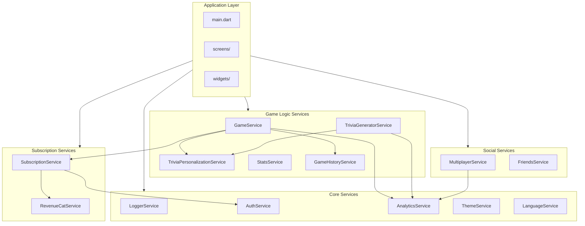
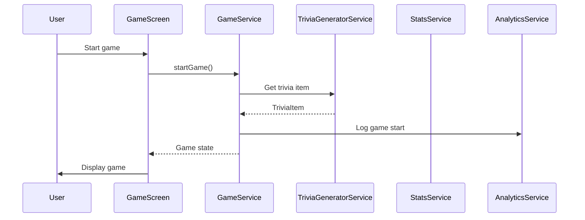
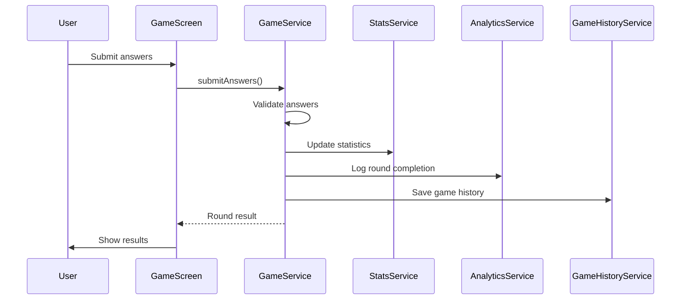
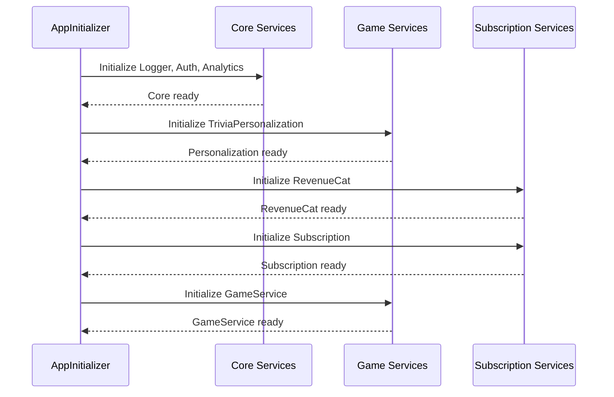
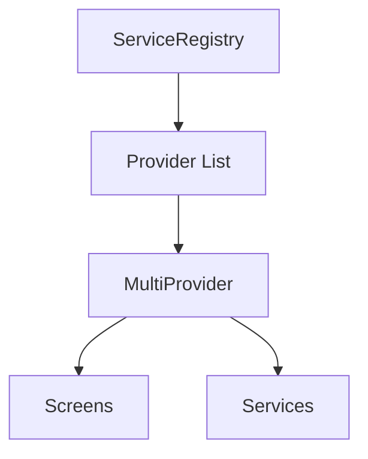
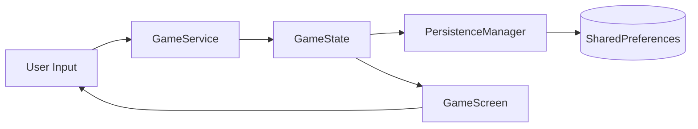
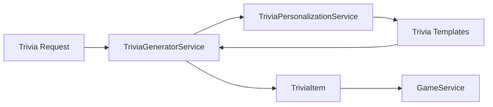

# N3RD Trivia Game - Architecture & Navigation Flow

## Comprehensive System Architecture

This document provides a complete overview of the N3RD Trivia game application architecture, including all services, screens, data flows, and navigation patterns.

## Architecture Diagram

```mermaid
graph TB
    subgraph "Application Layer"
        Main[main.dart<br/>App Entry Point]
        ErrorBoundary[ErrorBoundary Widget]
        RouteGuard[RouteGuard Widget]
        NavigationHelper[NavigationHelper<br/>Safe Navigation & Analytics]
        RouteConfig[RouteConfig<br/>Centralized Routes]
        NavigationState[NavigationStateService<br/>State Persistence]
    end

    subgraph "Core Services"
        AuthService[AuthService<br/>Authentication & User Management]
        GameService[GameService<br/>Core Game Logic]
        StatsService[StatsService<br/>Aggregated Statistics]
        GameHistoryService[GameHistoryService<br/>Game History Records]
        LeaderboardService[LeaderboardService<br/>Global Rankings]
        SubscriptionService[SubscriptionService<br/>Premium Access]
        RevenueCatService[RevenueCatService<br/>In-App Purchases]
    end

    subgraph "Feature Services"
        MultiplayerService[MultiplayerService<br/>Online Multiplayer]
        FriendsService[FriendsService<br/>Social Features]
        DirectMessageService[DirectMessageService<br/>Messaging]
        FamilyGroupService[FamilyGroupService<br/>Family Sharing]
        ChallengeService[ChallengeService<br/>Daily Challenges]
        AIModeService[AIModeService<br/>AI Adaptive Mode]
        TriviaGeneratorService[TriviaGeneratorService<br/>Content Generation]
        TriviaPersonalizationService[TriviaPersonalizationService<br/>Content Personalization]
    end

    subgraph "Support Services"
        AnalyticsService[AnalyticsService<br/>Event Tracking]
        LoggerService[LoggerService<br/>Error Logging]
        VideoCacheService[VideoCacheService<br/>Video Preloading]
        OfflineService[OfflineService<br/>Offline Support]
        OfflineQueueService[OfflineQueueService<br/>Operation Queue]
        NetworkService[NetworkService<br/>Connectivity]
        NotificationService[NotificationService<br/>Push Notifications]
        SoundService[SoundService<br/>Audio]
        HapticService[HapticService<br/>Haptic Feedback]
        AccessibilityService[AccessibilityService<br/>Accessibility Settings]
    end

    subgraph "Data Layer"
        Firestore[(Firestore<br/>Cloud Database)]
        SharedPreferences[(SharedPreferences<br/>Local Cache)]
        VideoAssets[(Video Assets<br/>MP4 Files)]
    end

    subgraph "Main Navigation Screens"
        TitleScreen[Title Screen<br/>/title]
        ModeSelectionScreen[Mode Selection<br/>/modes]
        GameScreen[Game Screen<br/>/game]
        StatsScreen[Stats Screen<br/>/stats]
        MoreMenuScreen[More Menu<br/>/more]
    end

    subgraph "Feature Screens"
        GameHistoryScreen[Game History<br/>/game-history]
        LeaderboardScreen[Leaderboard<br/>/leaderboard]
        FriendsScreen[Friends<br/>/friends]
        DirectMessageScreen[Direct Messages<br/>/direct-message]
        MultiplayerLobbyScreen[Multiplayer Lobby<br/>/multiplayer-lobby]
        MultiplayerGameScreen[Multiplayer Game<br/>/multiplayer-game]
        EditionsScreen[Editions<br/>/editions]
        SettingsScreen[Settings<br/>/settings]
        HelpCenterScreen[Help Center]
        AnalyticsDashboardScreen[Analytics Dashboard<br/>/analytics]
    end

    %% Application Layer Dependencies
    Main --> ErrorBoundary
    ErrorBoundary --> RouteGuard
    RouteGuard --> NavigationHelper
    NavigationHelper --> RouteConfig
    NavigationHelper --> NavigationState
    NavigationHelper --> AnalyticsService
    RouteConfig --> RouteGuard

    %% Core Service Dependencies
    GameService --> GameHistoryService
    GameService --> StatsService
    GameService --> SubscriptionService
    GameService --> AnalyticsService
    StatsService --> Firestore
    StatsService --> SharedPreferences
    GameHistoryService --> Firestore
    GameHistoryService --> SharedPreferences
    LeaderboardService --> Firestore
    SubscriptionService --> RevenueCatService
    SubscriptionService --> AuthService

    %% Feature Service Dependencies
    MultiplayerService --> Firestore
    MultiplayerService --> NetworkService
    MultiplayerService --> AnalyticsService
    FriendsService --> Firestore
    DirectMessageService --> Firestore
    FamilyGroupService --> Firestore
    ChallengeService --> Firestore
    TriviaGeneratorService --> TriviaPersonalizationService
    TriviaGeneratorService --> AnalyticsService

    %% Support Service Dependencies
    AnalyticsService --> Firestore
    OfflineService --> OfflineQueueService
    OfflineQueueService --> NetworkService
    AccessibilityService --> Firestore
    AccessibilityService --> SharedPreferences

    %% Screen to Service Connections
    TitleScreen --> GameService
    TitleScreen --> StatsService
    TitleScreen --> GameHistoryService
    TitleScreen --> LeaderboardService
    ModeSelectionScreen --> GameService
    GameScreen --> GameService
    GameScreen --> StatsService
    GameScreen --> GameHistoryService
    GameScreen --> SubscriptionService
    StatsScreen --> StatsService
    StatsScreen --> GameHistoryService
    GameHistoryScreen --> GameHistoryService
    LeaderboardScreen --> LeaderboardService
    FriendsScreen --> FriendsService
    DirectMessageScreen --> DirectMessageService
    MultiplayerLobbyScreen --> MultiplayerService
    MultiplayerGameScreen --> MultiplayerService
    EditionsScreen --> SubscriptionService
    SettingsScreen --> AuthService
    SettingsScreen --> SubscriptionService

    %% Data Flow
    GameService -.records game end.-> GameHistoryService
    GameService -.records stats.-> StatsService
    GameHistoryService -.saves.-> Firestore
    GameHistoryService -.caches.-> SharedPreferences
    StatsService -.saves.-> Firestore
    StatsService -.caches.-> SharedPreferences
    MultiplayerService -.syncs.-> Firestore
    FriendsService -.syncs.-> Firestore

    %% Navigation Flow
    TitleScreen -->|navigate| ModeSelectionScreen
    TitleScreen -->|navigate| StatsScreen
    TitleScreen -->|navigate| GameHistoryScreen
    TitleScreen -->|navigate| LeaderboardScreen
    TitleScreen -->|navigate| MoreMenuScreen
    ModeSelectionScreen -->|navigate| GameScreen
    GameScreen -->|game over| StatsScreen
    GameScreen -->|game over| GameHistoryScreen
    MoreMenuScreen -->|navigate| SettingsScreen
    MoreMenuScreen -->|navigate| HelpCenterScreen
    MoreMenuScreen -->|navigate| EditionsScreen
    StatsScreen -->|navigate| GameHistoryScreen
    StatsScreen -->|navigate| AnalyticsDashboardScreen
```



## Application Layer Architecture

### main.dart Refactoring (January 2025)

The application entry point (`main.dart`) has been refactored to use a modular architecture with clear separation of concerns. The refactoring reduced the file from 1,507 lines to 145 lines (90% reduction), achieving 71% under the ideal target.

#### Extracted Modules

1. **ServiceRegistry** (`lib/core/service_registry.dart`)
   - Centralizes all service provider creation
   - Manages dependency injection setup
   - Provides `createProviders()` and `createProxyProviders()` methods

2. **RouteBuilder** (`lib/core/route_builder.dart`)
   - Centralizes route definitions and generation
   - Handles dynamic routes and deep links
   - Provides `routes`, `onGenerateRoute()`, and `onUnknownRoute()` methods

3. **AppInitializer** (`lib/core/app_initializer.dart`)
   - Handles Firebase initialization
   - Manages trivia template loading
   - Initializes RevenueCat service
   - Sets up error handlers
   - Provides `initialize()` method returning initialization results

4. **AppConfiguration** (`lib/core/app_configuration.dart`)
   - MaterialApp theme configuration
   - Localization delegates setup
   - Accessibility MediaQuery builder
   - Provides static methods for app configuration

5. **AuthStateListener** (`lib/widgets/auth_state_listener.dart`)
   - Listens to authentication state changes
   - Automatically redirects to login when user logs out on protected routes
   - Handles navigation state management

#### Benefits

- **Reduced Complexity**: main.dart is now a thin orchestration layer (~145 lines)
- **Better Testability**: Each module can be tested independently
- **Improved Maintainability**: Changes to routes/services don't require editing main.dart
- **Clearer Separation**: Each responsibility in its own file
- **Single Source of Truth**: No duplication of provider/route definitions

For detailed refactoring information, see [CODE_COMPLEXITY.md](./CODE_COMPLEXITY.md#priority-refactoring-maindart).

## Service Architecture

This project follows a **service-oriented architecture** with dependency injection via Provider.

### Service Dependency Graph



### Core Services

1. **GameService** - Core game logic and state management
   - Uses manager pattern for separation of concerns (see [Game Managers Guide](./GAME_MANAGERS.md))
   - Managers: GameTriviaManager, GamePowerupManager, GamePersistenceManager, GameSelectionManager, GameCompetitiveChallengeManager, GameFlipModeManager (available as standalone utility, integration optional), GameModeSpecificManager (available as standalone utility, integration optional)
   - See [Game Managers Guide](./GAME_MANAGERS.md#integration-guide) for integration details
2. **TriviaGeneratorService** - Trivia question generation
3. **SubscriptionService** - Premium feature management
4. **AuthService** - User authentication
5. **AnalyticsService** - Event tracking and analytics
6. **StatsService** - Aggregated statistics
7. **GameHistoryService** - Game history records
8. **LeaderboardService** - Global rankings

### Dependency Injection

Services are provided via Provider and should be accessed using safe patterns:
```dart
// Safe access pattern (recommended for early initialization and utility widgets)
final service = ProviderHelper.safeGet<SomeService>(context, listen: false);
if (service != null) {
  // Use service
}

// Direct access (only safe after services are guaranteed to be initialized)
final service = Provider.of<SomeService>(context, listen: false);
```

**Provider Setup Pattern:**
- Single instance services use `ChangeNotifierProvider`
- Dependent services use `ProxyProvider` to reuse existing instances
- All services wired via `ServiceRegistry` with proper dependency order (see [ServiceRegistry](../lib/core/service_registry.dart))
- **Important**: Use `ProviderHelper.safeGet` during early initialization (e.g., in `main.dart`, route guards, utility widgets) to prevent `ProviderNotFoundException` crashes

## Service Interaction Patterns

### Initialization Flow
1. **App Startup** (`main.dart`)
   - Call `AppInitializer.initialize()` to initialize Firebase, trivia templates, and RevenueCat
   - Use `ServiceRegistry.createProviders()` to create all service providers
   - Use `ServiceRegistry.createProxyProviders()` to wire service dependencies
   - Configure MaterialApp using `AppConfiguration` static methods
   - Use `RouteBuilder.routes` and `RouteBuilder.onGenerateRoute()` for routing

2. **Service Initialization**
   - All services follow standardized `init()` pattern
   - Mutex prevents concurrent initialization
   - Initialization state tracked with `_isInitialized` flag
   - Errors logged but don't block app startup

### Data Flow Patterns

#### Game Completion Flow
```
GameService._setGameOver()
  ├─> GameHistoryService.recordGame() [non-blocking]
  │   ├─> Validates input
  │   ├─> Saves to Firestore (with retry)
  │   └─> Caches to SharedPreferences
  │
  └─> StatsService.recordGameEnd() [with mutex]
      ├─> Validates input
      ├─> Updates local state
      ├─> Firestore transaction (atomic update)
      └─> Local cache backup
```

#### Real-time Data Sync
- **FriendsService**: Listens to `friends` collection
- **DirectMessageService**: Listens to `conversations` subcollection
- **MultiplayerService**: Listens to `game_rooms` collection
- **GameHistoryService**: Listens to `game_history` subcollection
- All streams include `onError` callbacks for permission-denied handling

### Service Interaction Flows

#### Game Start Flow



#### Answer Submission Flow



#### Service Initialization Flow



### Service Dependencies

#### Core Services (No Dependencies)

These services have no dependencies and can be initialized first:

- `LoggerService` - Logging utility
- `FirebaseHelper` - Safe Firebase access with initialization checks
- `ProviderHelper` - Safe provider access with error handling
- `JsonHelper` - Safe JSON decoding with type checking
- `AuthService` - Authentication
- `AnalyticsService` - Analytics tracking
- `ThemeService` - Theme management
- `LanguageService` - Language/localization
- `SettingsService` - App settings
- `SoundService` - Audio playback
- `NotificationService` - Push notifications
- `NetworkService` - Network connectivity
- `OfflineService` - Offline mode
- `AccessibilityService` - Accessibility settings management
  - Manages high contrast mode, font size multiplier, larger touch targets, extended time limits, reduced motion
  - Settings persistence (local + Firestore)
  - Change notifications via `ChangeNotifier`
  - See [ACCESSIBILITY.md](./ACCESSIBILITY.md) for complete documentation

#### Game Logic Services

**GameService**
- Dependencies: `TriviaPersonalizationService`, `TriviaGamificationService`, `AnalyticsService`, `SubscriptionService`, `GameHistoryService`
- Initialization Order: After personalization, gamification, analytics, subscription, and game history services

**TriviaGeneratorService**
- Dependencies: `TriviaPersonalizationService`, `AnalyticsService`, `EditionTriviaTemplates` (data)
- Initialization Order: After personalization and analytics services, requires trivia templates to be loaded

**TriviaPersonalizationService**
- Dependencies: None (core service)

**TriviaGamificationService**
- Dependencies: None (core service)

**AIEditionService**
- Dependencies: `TriviaPersonalizationService`, `TriviaGeneratorService`, `AnalyticsService`
- Initialization Order: After personalization, generator, and analytics services

#### Subscription Services

**RevenueCatService**
- Dependencies: None (core service)

**SubscriptionService**
- Dependencies: `RevenueCatService`, `AuthService`
- Initialization Order: After RevenueCat and Auth services

**EditionAccessService**
- Dependencies: `RevenueCatService`, `SubscriptionService`
- Initialization Order: After RevenueCat and Subscription services

#### Social Services

**MultiplayerService**
- Dependencies: `AnalyticsService`
- Initialization Order: After Analytics service

**FriendsService**
- Dependencies: None (core service)

**FamilyGroupService**
- Dependencies: None (core service)

**DirectMessageService**
- Dependencies: None (core service)

**NewsfeedService**
- Dependencies: None (core service)

**SocialDiscoveryService**
- Dependencies: None (core service)

### Service Dependency Matrix

| Service | Depends On | Initialization Order |
|---------|------------|---------------------|
| LoggerService | None | 1 |
| AuthService | None | 1 |
| AnalyticsService | None | 1 |
| ThemeService | None | 1 |
| LanguageService | None | 1 |
| SettingsService | None | 1 |
| SoundService | None | 1 |
| NotificationService | None | 1 |
| NetworkService | None | 1 |
| OfflineService | None | 1 |
| AccessibilityService | None | 1 |
| TriviaPersonalizationService | None | 2 |
| TriviaGamificationService | None | 2 |
| RevenueCatService | None | 3 |
| MultiplayerService | AnalyticsService | 4 |
| FriendsService | None | 4 |
| FamilyGroupService | None | 4 |
| DirectMessageService | None | 4 |
| NewsfeedService | None | 4 |
| SocialDiscoveryService | None | 4 |
| TriviaGeneratorService | TriviaPersonalizationService, AnalyticsService | 2 |
| SubscriptionService | RevenueCatService, AuthService | 3 |
| EditionAccessService | RevenueCatService, SubscriptionService | 3 |
| GameService | TriviaPersonalizationService, TriviaGamificationService, AnalyticsService, SubscriptionService, GameHistoryService | 2 |
| AIEditionService | TriviaPersonalizationService, TriviaGeneratorService, AnalyticsService | 2 |

### Circular Dependencies

**None detected.** The current architecture avoids circular dependencies by:
- Using dependency injection via Provider
- Separating concerns into distinct services
- Using interfaces for loose coupling

### Service Lifecycle

#### Service Initialization Order

Services must be initialized in the following order:

1. **Core Services (No Dependencies)**
   - LoggerService
   - AuthService
   - AnalyticsService
   - ThemeService
   - LanguageService
   - SettingsService
   - SoundService
   - NotificationService
   - NetworkService
   - OfflineService
   - AccessibilityService

2. **Game Logic Services**
   - TriviaPersonalizationService
   - TriviaGamificationService
   - TriviaGeneratorService (requires templates loaded)
   - GameService
   - AIEditionService

3. **Subscription Services**
   - RevenueCatService
   - SubscriptionService
   - EditionAccessService

4. **Social Services**
   - MultiplayerService
   - FriendsService
   - FamilyGroupService
   - DirectMessageService
   - NewsfeedService
   - SocialDiscoveryService

#### Service Disposal

Services are disposed in reverse order of initialization:

1. Social Services
2. Subscription Services
3. Business Logic Services
4. Foundation Services
5. Core Services

All services that extend `ChangeNotifier` must:
1. Implement `init()` if async initialization is needed
2. Implement `dispose()` for cleanup
3. Be registered in `main.dart` MultiProvider

### Service Communication Patterns

#### Pattern 1: Direct Method Call

```dart
// Service A directly calls Service B
gameService.updateStats(score);
```

#### Pattern 2: Event-Based Communication

```dart
// Service A notifies listeners via ChangeNotifier
gameService.notifyListeners();
```

#### Pattern 3: Provider-Based Access

```dart
// Service accessed via Provider
final gameService = Provider.of<GameService>(context);
```

#### Pattern 4: Direct Dependency Injection

```dart
// Service A depends on Service B
class ServiceA {
  ServiceB? _serviceB;
  void setServiceB(ServiceB service) {
    _serviceB = service;
  }
}
```

#### Pattern 5: Provider-Based Dependency

```dart
// Service A is provided via ProxyProvider
ProxyProvider<ServiceB, ServiceA>(
  update: (_, serviceB, previous) {
    previous?.setServiceB(serviceB);
    return previous ?? ServiceA();
  },
)
```

#### Pattern 6: Optional Dependencies

```dart
// Service A has optional dependency on Service B
class ServiceA {
  ServiceB? _serviceB;
  
  void doSomething() {
    if (_serviceB != null) {
      _serviceB!.doSomething();
    }
    // Continue without service B
  }
}
```

### Service Registration

Services are registered in `ServiceRegistry` and provided via Provider:



### Data Flow Diagrams

#### Game State Flow



#### Trivia Generation Flow



### Service Metrics

- **Total Services**: 74 main service classes
- **Core Services**: 11
- **Game Services**: 15+
- **Social Services**: 8+
- **Subscription Services**: 3
- **Support Services**: 30+

### Troubleshooting Service Dependencies

#### Service Not Initialized
- Check initialization order
- Verify service is in provider list
- Check for circular dependencies

#### Service Dependency Missing
- Verify dependency is initialized before dependent service
- Check ProxyProvider configuration
- Ensure service is added to provider list

#### Circular Dependency
- Refactor to remove circular dependency
- Use event bus or callback pattern
- Extract shared logic to separate service

## State Management

### Immutable State Pattern

Game state uses immutable objects (`GameState`, `TriviaItem`) to prevent:
- Accidental mutations
- Race conditions
- State synchronization issues

### State Updates

State changes happen through:
- `copyWith()` for immutable objects
- `notifyListeners()` for ChangeNotifier services
- Proper async/await for state persistence

## Error Handling

### Multi-Layer Error Handling

1. **Service Level**: Try-catch with logging
2. **UI Level**: Error boundaries and user-friendly messages
3. **Analytics Level**: Crashlytics integration

### Error Recovery

- Services degrade gracefully on errors
- User-facing errors show recovery options
- All errors are logged for debugging

### Error Handling Patterns

1. **Firestore Streams**: All include `onError` callbacks
2. **Permission Errors**: Handled gracefully, clear UI state
3. **Network Errors**: Retry logic with exponential backoff
4. **Timeout Handling**: All async operations have timeouts
5. **Transaction Failures**: Fallback to local save

### Race Condition Prevention

1. **Mutexes**: 
   - `_isSettingGameOver` in GameService
   - `_isRecordingGameEnd` in StatsService
   - `_isSaving` in StatsService
   - `_isInitializing` in all services

2. **Timer Cancellation**: All timers checked for disposal before execution
3. **State Validation**: Input validation before state changes

## Navigation Architecture

The navigation system provides centralized route management, safe navigation patterns, state persistence, and comprehensive analytics tracking.

### Core Components

1. **RouteConfig** (`lib/config/route_config.dart`)
   - Centralized route configuration with metadata
   - Route parameter schemas and validation
   - Transition type definitions
   - Route documentation

2. **NavigationHelper** (`lib/utils/navigation_helper.dart`)
   - Safe navigation methods with error recovery
   - Analytics tracking integration
   - Navigation state management
   - Automatic retry with exponential backoff

3. **NavigationStateService** (`lib/services/navigation_state_service.dart`)
   - Navigation stack persistence
   - Last route tracking
   - Navigation history (50 entry limit)
   - Deep link restoration via secure storage

4. **RouteRegistry** (`lib/config/route_config.dart`)
   - Route configuration registry
   - Route validation and access control
   - Route creation with consistent transitions
   - Route documentation generation

### Route Configuration

All routes are defined in `RouteRegistry` with:
- **Path**: Route path (e.g., `/game`, `/settings`)
- **Metadata**: `requiresAuth`, `requiresPremium`, `requiresOnlineAccess`, etc.
- **Parameters**: Parameter schemas with validation
- **Transitions**: Smooth, scale, fade, or none
- **Documentation**: Parameter descriptions and usage examples

Example route configuration:
```dart
'/game': RouteConfig(
  path: '/game',
  requiresAuth: true,
  parameters: {
    'mode': RouteParameter(name: 'mode', type: GameMode, required: false),
    'difficulty': RouteParameter(name: 'difficulty', type: String, required: false),
    'customTriviaPool': RouteParameter(name: 'customTriviaPool', type: List, required: false),
  },
  documentation: 'Main game screen with optional mode, difficulty, or custom trivia',
  transitionType: RouteTransitionType.smooth,
)
```

### Navigation Patterns

#### Standardized Navigation

**All navigation must use NavigationHelper methods** - direct `Navigator` calls are not allowed:

```dart
// ✅ Correct
NavigationHelper.safeNavigate(context, '/game', arguments: {'mode': GameMode.classic});

// ❌ Incorrect
Navigator.pushNamed(context, '/game', arguments: {'mode': GameMode.classic});
```

Available navigation methods:
- `safeNavigate()` - Push new route with optional arguments
- `safePop()` - Pop current route with optional result
- `safePush()` - Push Route object with analytics
- `safePushReplacementNamed()` - Replace current route
- `safeNavigateAndRemoveUntil()` - Clear navigation stack
- `switchToTab()` - Switch main navigation tabs

#### Navigation Sources

All navigation events track their source for analytics:
- `buttonTap` - User tapped a button
- `deepLink` - Deep link opened
- `backButton` - Back button pressed
- `programmatic` - Code-initiated navigation
- `tabSwitch` - Tab navigation

#### Error Recovery

Navigation includes automatic retry with exponential backoff:
- Maximum 2 retries per navigation attempt
- Exponential backoff (100ms, 200ms delays)
- User-friendly error messages
- Analytics tracking of navigation failures

### Navigation Patterns

1. **Tab Navigation**: MainNavigationWrapper with 5 tabs
   - Tab 0: Title Screen (`/title`)
   - Tab 1: Mode Selection (`/modes`)
   - Tab 2: Stats (`/stats`)
   - Tab 3: Friends (`/friends`)
   - Tab 4: More Menu (`/more`)

2. **Stack Navigation**: Standard Flutter navigation stack
   - Uses `safeNavigate()` for pushing routes
   - Consistent transitions via `RouteRegistry.createRoute()`

3. **Modal Navigation**: Bottom sheets, dialogs
   - Uses `safePush()` for custom routes
   - Managed via `NavigationHelper`

4. **Deep Linking**: Route-based navigation with arguments
   - Supports query params: `/family-invitation?groupId=xxx`
   - Supports path params: `/family-invitation/xxx`
   - Supports arguments object
   - Unified parsing in `onGenerateRoute`

### Route Registry

The `RouteRegistry` provides:
- **38+ routes** fully configured
- **Access control validation** (auth, premium, online access)
- **Parameter validation** against schemas
- **Consistent transitions** (smooth, scale, fade)
- **Route documentation** via `getDocumentation()`

Key methods:
- `getRouteConfig(path)` - Get route configuration
- `validateRouteArguments(path, arguments)` - Validate arguments
- `createRoute(path, page, settings)` - Create route with proper transition
- `getDocumentation(path)` - Get formatted route documentation

### Navigation State Management

`NavigationStateService` provides:
- **Stack Persistence**: Save and restore navigation stack
- **Last Route Tracking**: Remember last visited route
- **Navigation History**: Track recent routes (50 entries)
- **Deep Link Restoration**: Save deep links for post-auth navigation

State is persisted to:
- `SharedPreferences` for non-sensitive data
- `SecureStorageService` for sensitive deep links

### Access Control

Route access control is enforced via `RouteGuard` widget and validated in `RouteRegistry`:

- **Premium Features**: `RouteGuard` checks `SubscriptionService.isPremium`
- **Online Features**: `RouteGuard` checks network connectivity via `NetworkService`
- **Authentication**: `RouteGuard` checks `AuthService.isAuthenticated`
- **Family/Friends**: `RouteGuard` checks subscription tier for family/friends features
- **Editions Access**: `RouteGuard` checks subscription tier for AI editions

Access control metadata is defined in `RouteConfig` and enforced at:
1. Route generation time (via `RouteRegistry`)
2. Widget level (via `RouteGuard` wrapper)

### Analytics Integration

All navigation events are tracked:
- **Screen Views**: Tracked via `AnalyticsService.logScreenView()`
- **Transition Durations**: Tracked via `AnalyticsService.logNavigationTransition()`
- **Navigation Errors**: Tracked via `AnalyticsService.logNavigationError()`
- **Source Tracking**: Navigation source (button, deep link, etc.)

### Deep Link Handling

Deep links are handled consistently:
1. **Parsing**: Unified parser in `RouteBuilder.onGenerateRoute()` (see [RouteBuilder](../lib/core/route_builder.dart))
2. **Validation**: Parameter format validation (e.g., Firestore IDs)
3. **Restoration**: Saved to secure storage if auth required
4. **Execution**: Restored after authentication completes

Supported deep link formats:
- Query params: `/family-invitation?groupId=abc123`
- Path params: `/family-invitation/abc123`
- Arguments object: `{'groupId': 'abc123'}`

### Route Transitions

All routes use consistent transitions via `RouteRegistry.createRoute()`:
- **Smooth**: Slide + fade (default, 250ms)
- **Scale**: Scale + fade (400ms for mode transitions)
- **Fade**: Fade only
- **None**: Standard MaterialPageRoute

Transitions are configured per-route in `RouteConfig`.

### Complete Route List

The application has 38+ routes configured, including:
- Main navigation: `/title`, `/modes`, `/stats`, `/friends`, `/more`
- Game routes: `/game`, `/mode-transition`, `/general-transition`
- Multiplayer: `/multiplayer-lobby`, `/multiplayer-loading`, `/multiplayer-game`
- Social: `/direct-message`, `/leaderboard`, `/newsfeed`, `/social-discovery`
- Features: `/game-history`, `/daily-challenges`, `/word-of-day`
- Editions: `/editions-selection`, `/editions`, `/youth-editions`, `/ai-edition-input`, `/ai-edition-history`
- Settings: `/settings`, `/subscription-management`, `/family-management`, `/family-invitation`
- Help: `/help-center`, `/support-dashboard`, `/feedback`
- Premium: `/analytics`, `/performance-insights`, `/voice-calibration`, `/learning`, `/practice`, `/trivia-creator`
- Legal: `/privacy-policy`, `/terms-of-service`

All routes are fully documented in `RouteRegistry` with parameter schemas and usage examples.

## Data Storage Architecture

### Firestore Collections

```
users/
  {userId}/
    game_history/          # GameHistoryService
      {gameId}
    conversations/         # DirectMessageService
      {conversationId}/
        messages/
          {messageId}
    stats                  # StatsService (document)
    
game_rooms/                # MultiplayerService
  {roomId}
  
friends/                   # FriendsService
  {friendId}
  
friend_requests/           # FriendsService
  {requestId}
  
user_stats/                # LeaderboardService
  {userId}
  
family_groups/             # FamilyGroupService
  {groupId}
```

### Local Storage (SharedPreferences)

- Game stats cache
- Game history cache (last 100 games)
- User preferences
- Offline operation queue
- Flip reveal mode setting

## Performance Optimizations

1. **Video Caching**: Priority videos preloaded on app start
2. **Pagination**: Large lists use pagination (20-100 items per page)
3. **Lazy Loading**: Infinite scroll for game history, leaderboard
4. **Query Optimization**: Firestore queries use indexes, limits
5. **Memory Management**: Proper disposal of controllers, timers, subscriptions

### Caching Strategy

- Animation paths cached after first lookup
- Trivia templates loaded once at startup
- State persistence uses debouncing

### Lazy Loading

- Services initialize on-demand
- Animations loaded as needed
- Templates parsed only when required

## Security & Validation

1. **Input Sanitization**: All user input sanitized before Firestore writes
2. **Data Validation**: Range checks, type validation, required fields
3. **Firestore Rules**: Server-side security rules enforce access control
4. **Transaction Safety**: Critical operations use Firestore transactions

## Offline Support

1. **Offline Queue**: Operations queued when offline
2. **Local Cache**: Critical data cached in SharedPreferences
3. **Sync on Reconnect**: Automatic sync when connectivity restored
4. **Retry Logic**: Exponential backoff for failed operations

## Code Organization

### Directory Structure

```
lib/
├── models/          # Data models
├── services/        # Business logic services
├── screens/         # UI screens
├── widgets/         # Reusable widgets
├── config/          # Configuration constants
├── data/            # Static data (templates, etc.)
├── utils/           # Utility functions
│   ├── firebase_helper.dart    # Safe Firebase access
│   ├── provider_helper.dart    # Safe provider access
│   └── json_helper.dart        # Safe JSON decoding
└── l10n/            # Localization
```

### Naming Conventions

- Services: `*Service` (e.g., `GameService`)
- Models: PascalCase (e.g., `GameState`)
- Screens: `*Screen` (e.g., `TitleScreen`)
- Widgets: `*Widget` (e.g., `UnifiedBackgroundWidget`, `VideoPlayerWidget`)

## Testing Considerations

- Services are testable (dependency injection)
- State management via ChangeNotifier
- Error boundaries catch UI errors
- Comprehensive logging for debugging

### Testing Strategy

#### Unit Tests
- Service logic
- State management
- Utility functions

#### Integration Tests
- Service interactions
- Game flows
- User journeys

#### Widget Tests
- UI components
- State updates
- User interactions

## Best Practices

### General Best Practices

1. **Always validate inputs** - Never trust external data
2. **Handle errors gracefully** - Never crash silently
3. **Dispose resources** - Prevent memory leaks
4. **Document public APIs** - Help future developers
5. **Write tests** - Ensure code quality
6. **Use mutexes** - Prevent race conditions
7. **Cache appropriately** - Balance performance and memory
8. **Monitor performance** - Track key metrics

### Service Architecture Best Practices

1. **Single Responsibility**: Each service has one clear purpose
2. **Dependency Injection**: Services are injected via Provider
3. **Loose Coupling**: Services communicate via interfaces when possible
4. **Error Handling**: Services handle errors gracefully
5. **Lifecycle Management**: Services properly initialize and dispose resources
6. **Avoid Circular Dependencies**: If Service A depends on Service B, Service B should not depend on Service A
7. **Use Interfaces**: Define interfaces for services to enable loose coupling
8. **Lazy Initialization**: Initialize services only when needed
9. **Optional Dependencies**: Make dependencies optional when possible to improve resilience## Related Documentation

- **[ADRs/](./ADRs/)** - Architecture Decision Records documenting key technical decisions:
  - [ADR-001: Font Loading Strategy](./ADRs/001-font-loading-strategy.md) - Font loading approach
  - [ADR-002: Multiplayer Security Model](./ADRs/002-multiplayer-security-model.md) - Multiplayer security architecture
  - [ADR-003: State Persistence Strategy](./ADRs/003-state-persistence-strategy.md) - State management and persistence
  - [ADR-004: Error Recovery Mechanisms](./ADRs/004-error-recovery-mechanisms.md) - Error recovery patterns
  - [ADR-005: Performance Monitoring](./ADRs/005-performance-monitoring.md) - Performance tracking approach
  - [ADR-006: Subscription Routing Architecture](./ADRs/006-subscription-routing-architecture.md) - Subscription system design
  - [ADR-007: Error Handling Strategy](./ADRs/007-error-handling-strategy.md) - Error handling patterns

---*Last Updated: January 2025*